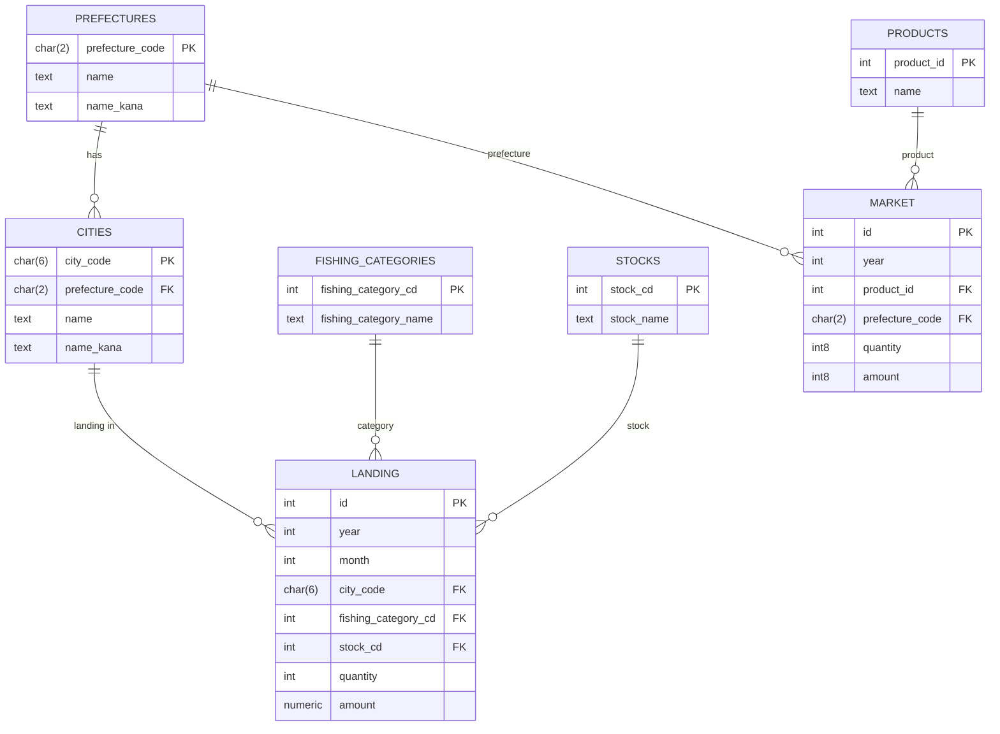

# fish-hack

本レポジトリは、[FISH×TECHハッカソン #いしかわの海の幸をアプデせよ](https://techplay.jp/event/989316)で提供されるデータをPostgreSQLに格納するコードを管理、提供します。なおこのレポジトリの作者[ToYama](https://github.com/ToYama170402)はFISH×TECHハッカソンには参加しておりません。

## ER図

以下はデータベースのER図（Mermaid）です。



## ディレクトリ構造

```text
.
├── README.md                                    # このファイル
├── docker-compose.yml
└── docker-entrypoint.initdb.d                   # PostgreSQLコンテナを初期化するためのクエリとデータを保存
    ├── 00_prefecture_city_code.sql              # 都道府県・市町村コードテーブルを作成する初期化SQL
    ├── 10_landing.sql                           # 水揚げデータテーブルを作成する初期化SQL
    ├── 20_market.sql                            # 金沢中央卸売市場のテーブルを作成する初期化SQL
    ├── 金沢市中央卸売市場_水産物部_塩干.csv
    ├── 金沢市中央卸売市場_水産物部_鮮魚.csv
    ├── 金沢市中央卸売市場_水産物部_冷凍魚.csv
    ├── 石川県水揚げデータ_2025_12_18.csv
    └── 都道府県コード.csv
```

## データソース

### `docker-entrypoint.initdb.d/金沢市中央卸売市場_水産物部_塩干.csv`

- 出典：[石川県オープンデータカタログサイト](https://ckan.opendata.pref.ishikawa.lg.jp/dataset/kanazawa_market_products_by_origin_annual/resource/eaf82644-eeff-4124-8b1c-464820905de9)
- ライセンス：[CC BY 4.0](https://opendefinition.org/licenses/cc-by/)

### `docker-entrypoint.initdb.d/金沢市中央卸売市場_水産物部_鮮魚.csv`

- 出典：[石川県オープンデータカタログサイト](https://ckan.opendata.pref.ishikawa.lg.jp/dataset/kanazawa_market_products_by_origin_annual/resource/65cf9249-739b-48a1-a0f3-686317433b1a)
- ライセンス：[CC BY 4.0](https://opendefinition.org/licenses/cc-by/)

### `docker-entrypoint.initdb.d/金沢市中央卸売市場_水産物部_冷凍魚.csv`

- 出典：[石川県オープンデータカタログサイト](https://ckan.opendata.pref.ishikawa.lg.jp/dataset/kanazawa_market_products_by_origin_annual/resource/efe6e131-395f-4401-b3d2-0d7974f6e11e)
- ライセンス：[CC BY 4.0](https://opendefinition.org/licenses/cc-by/)

### `docker-entrypoint.initdb.d/石川県水揚げデータ_2025_12_18.csv`

- 出典：[石川県オープンデータカタログサイト](https://ckan.opendata.pref.ishikawa.lg.jp/dataset/fish)
- ライセンス：[CC BY 4.0](https://opendefinition.org/licenses/cc-by/)
- 備考：Excel形式からCSVに変換済み。

### `docker-entrypoint.initdb.d/都道府県コード.csv`

- 出典：[総務省 都道府県コード及び市区町村コード](https://www.soumu.go.jp/denshijiti/code.html)
